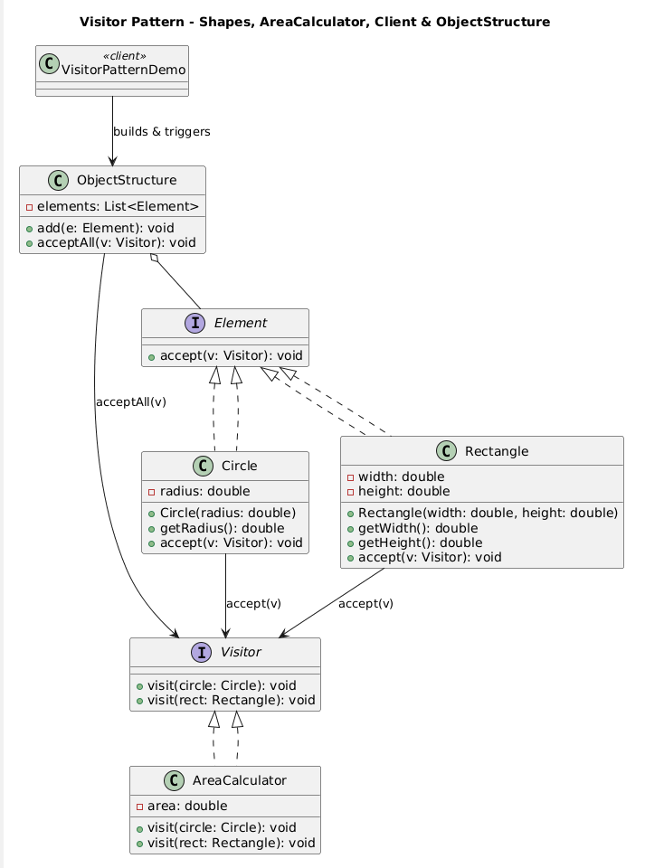

# Visitor Pattern — Area Calculation

This project demonstrates the **Visitor Pattern** in Java by calculating the area of different shapes using a **Visitor**.

## Structure

- `Visitor` — the **Visitor** interface that defines the `visit()` method for each element type.
- Concrete Visitors:
  - `AreaCalculator` — calculates the area of the shapes.
- `Element` — the **Element** interface that defines the `accept()` method.
- Concrete Elements:
  - `Circle` — a concrete element representing a circle.
  - `Rectangle` — a concrete element representing a rectangle.
- `VisitorPatternDemo` — Client to demonstrate the Visitor Pattern.

## How to run

```bash
javac *.java
java VisitorPatternDemo
```
## UML Diagram

Below is the UML diagram representing the **Visitor Pattern** structure:


